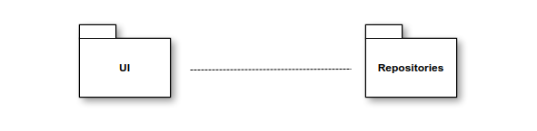
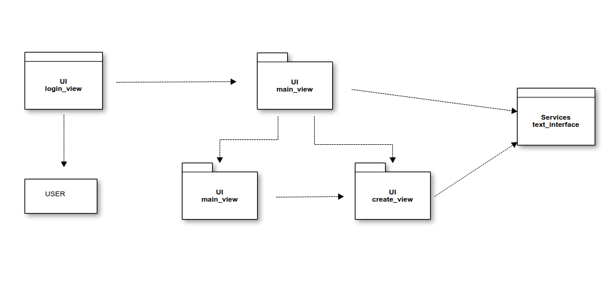
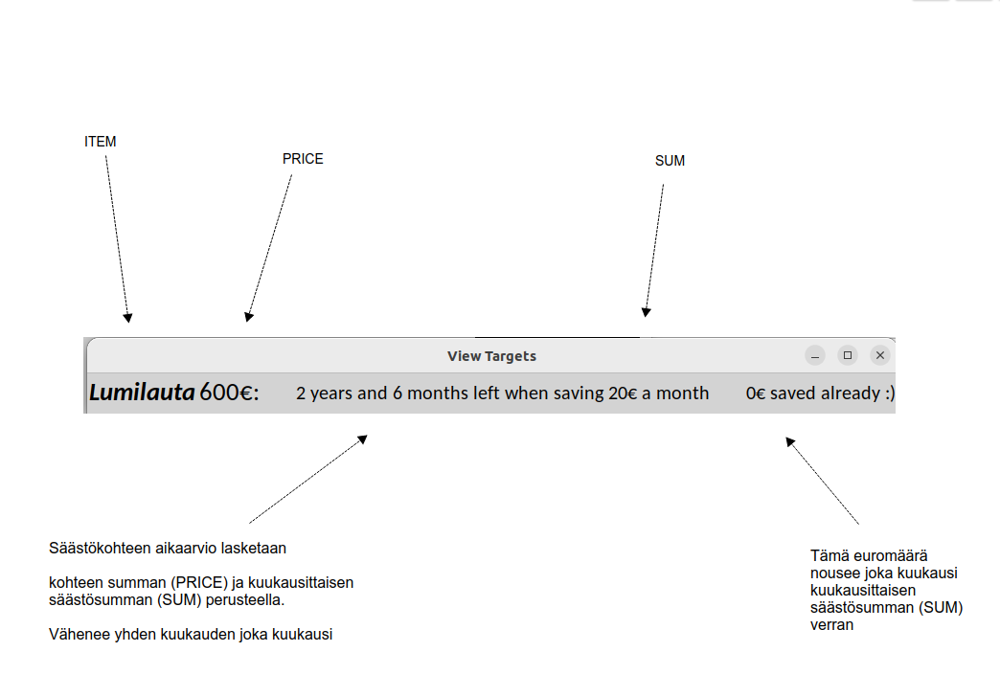

# Arkkitehtuuri määritelmä

### Pakkausrakenne





UI sisältää käyttöliittymän. 4 eri tiedostoa, jotka kuvaavat eri ikkunoita sovelluksessa. Suurin osa toiminnallisuudesta myös täällä. Services sisältää muutaman toiminnallisuuden.

### Käyttöliittymä

  - Kirjautuminen
      - Sisältää mahdollisuuden sisään kirjautumiseen
  - Valikko (create,view,delete all)
      - Sisältää mahdollisuuden säästökohteiden luomiseen, tarkasteluun sekä niiden poistamiseen
  - Säästökohteiden luominen
      - Käyttäjältä kysytään 3 kysymystä, joiden perusteella luodaan säästökohde sekä lasketaan sen saavuttamiseen kuluva aika
  - Säästökohteiden tarkastelu
      - Täällä pystyy tarkastella omia säästökohteita

Kaikki ovat omissa tiedostoissaan ja näin ollen myös omissa luokissa. Jokaisen näkymän tiedosto sisältää myös suurimman osan sen tominnasta, UI tiedostot tekevät myös yhteistyötä toistensa kanssa.  
Tarkoitus oli täysin erottaa sovelluslogiikka sekä käyttöliittymä, mutta en siinä onnistunut. Mielestäni kuitenkin sain ihan selkeän kokonaisuuden rakennettua näinkin.

Valikko ja säästökohteiden luominen tai valikko ja sääsötkohteiden tarkastelu voivat olla yhtä aikaa auki. Näin ollen on helpompi palata valikkoon säästökohteiden luonnin/tarkastelun jälkeen. 





### Tietojen tallennus

  - Käyttäjän säästökohteet tallennetaan CSV-tiedostoon, jossa ne pysyvät kunnes käyttäjä päättää ne poistaa.
  - Näitä hallitaan tiedostoissa 
        - create_view.py funktiolla save
        - view_view.py funktiolla view_target


  - pilkku erottaa arvot toisistaan ja CSV-tiedostoon talletus tehdään tässä muodossa: 
  
          id,creation-date,item,price,sum
   
        
       *id* = Services -> text_interface.py -> def get_id() määrittelee säästökohteelle ID:n sen mukaan monesko säästökohde se on  
       *creation-date* = pythonin oma date.today -funktio kertoo minä päivänä säästökohde on lisätty  
       *item* = käyttäjältä kysytään säästökohdetta  
       *price* = käyttäjältä kysytään säästökohteen hintaa  
       *sum* = käyttäjältä kysytään kuukausittainen säästösumma  


        Esimerkki:
        1,2022-12-23,Lumilauta,600,20
    
   
   
   
   sovelluksessa CSV-tiedostoon tallennettua dataa hyödynnetään näin:
   
   
   
   
   ### Päätoiminnallisuudet
   
   Käyttäjän kirjautuminen
   
   ```mermaid
sequenceDiagram
  actor hemppa
  participant Login_view
  participant User
  hemppa->>Login_view: click "Login" button
  Login_view->>User: login("hemppa", "jeejee")
  User-->>Login_view: username:("hemppa")
  Login_view-->> main_view: after log in
```

Säästökohteen luominen


   ```mermaid
sequenceDiagram
  actor hemppa
  participant main_view
  participant create_view
  hemppa->>main_view: click "create" button
  main_view->>create_view: Create().create_target()
  hemppa-->>create_view: *täyttää kolme kysymysboksia* , clicks "save" button
  create_view-->> create_view: save()
```


Luomisen yhteydessä sovellus tallettaa käyttäjän säästökohteen CSV-tiedostoon.


  # Ohjelman rakenteen heikkoudet
  
  Ohjelma on luotu hieman liian tiiviiksi. Olisi pitänyt erotella eri tiedostoihin eri asioita tekevät funktiot paremmin.
   
   
   
   
   
   
      

