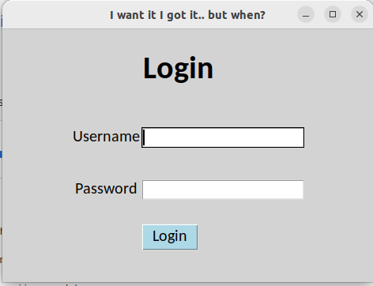
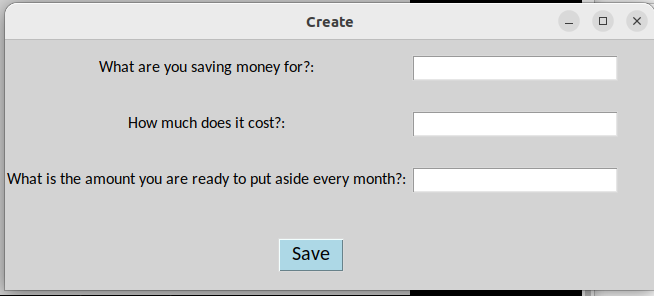
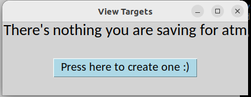
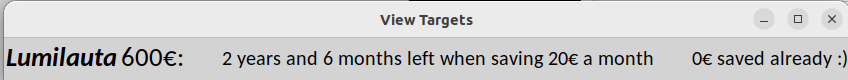

# Käyttöohje

### Ohjelman käynnistys

Asennetaan riippuvuudet:
    - poetry install

Käynnistys komennolla:
    - poetry run invoke start

### Kirjautuminen

Sovelluksen login- ikkunasta pääsee vain yhdillä käyttäjätunnuksilla sisään

username = **hemppa**  
password = **jeejee**

### Valikko ja eteneminen

*create*
 
- Luo säästäkohteita

*view*

-Tarkastele säästökohteita ja näe kuinka monta kuukautta/vuotta niiden saamiseksi on + oma jo säästetty summa

Näkymä kun yhtään säästökohdetta ei ole vielä lisätty:

Näkymä kun säästökohde on lisätty:

Pieni !HUOM!: Sovellus ottaa ylös säästökohteen luomispäivän eli jos tänään lisää kohteen ja heti katsoo kauan on säästetty niin luonnollisesti säästetty summa on 0e ja kuukaudet laskettu sen mukaan kuinka kauan tästä päivästä on jotta saat ostettua kohteen. Jos katsoo esim kuukauden kuluttua on säästetty summa noussut ilmoitetun kuukausisäästösumman verran ja kuukaudet vähentynyt. Kun kuukaudet ovat 0 niin säästökohde häviää view näkymästä.

