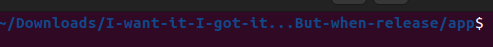

# Käyttöohje

### Ohjelman käynnistys

Lataa ensiksi sovellus täältä:

[Release](https://github.com/henniseppis/I-want-it-I-got-it...But-when/releases/tag/release)

---

- **!TÄRKEÄ!** kun olet ladannut sovelluksen koneelle avaa kansio terminaalissa ja mene kansioon "app" komennolla:

    - cd app
    
     TAI vaihtoehtoisesti:  
     manuaalisesti ladatun tiedoston kansiossa app kansioon ja vasta sen jälkeen avaa se terminaaliin 
    
Kuitenkin tarkista ennen etenemistä, että seuraavat asiat tapahtuvat app- kansiossa ja terminaalissa näyttää kutakuinkin tältä:

- Asennetaan riippuvuudet:  
    - poetry install
 
- **!TÄRKEÄ!** Luodaan targets.csv - tiedosto app- kansioon komennolla:
 
    - touch targets.csv
 
- Jonka jälkeen käynnistys komennolla:  
    - poetry run invoke start
    
 

### Kirjautuminen

Sovelluksen login- ikkunasta pääsee vain yhdillä käyttäjätunnuksilla sisään

username = **hemppa**  
password = **jeejee**

### Valikko ja eteneminen

kirjautumisen jälkeen näkyvä valikko

Buttons:

*create*
 
- Luo säästäkohteita

*view*

- Tarkastele säästökohteita ja näe kuinka monta kuukautta/vuotta niiden saamiseksi on + oma jo säästetty summa

Näkymä kun yhtään säästökohdetta ei ole vielä lisätty:

Näkymä kun säästökohde on lisätty:

*Delete all*

- Poistaa kaikki säästökohteet tiedostosta

----

Pieni !HUOM!: Sovellus ottaa ylös säästökohteen luomispäivän eli jos tänään lisää kohteen ja heti katsoo kauan on säästetty niin luonnollisesti säästetty summa on 0e ja kuukaudet laskettu sen mukaan kuinka kauan tästä päivästä on jotta saat ostettua kohteen aloittaen ensikuusta. Jos katsoo esim kuukauden kuluttua on säästetty summa noussut ilmoitetun kuukausisäästösumman verran ja kuukaudet vähentynyt. Kun kuukaudet ovat 0 niin säästökohde häviää view näkymästä.

