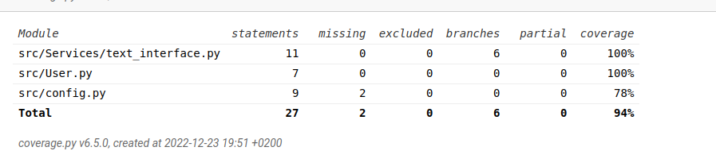

# Testaus

#### Unittest
Ohjelmaan on luotu unittestejä sekä myös manuaalisesti sovellusta käytettäessä pystyy testaamaan mahdollisia error tilanteita.

Unittestin avulla on testattu text_interface.py sekä user.py tiedostoja. Koska suurin koodista on tehty tkinter tiedostojen yhteyteen niin unittestit jäi hieman vähäiseksi valitettavasti.

Prosentti on 94% vaikka hirveän montaa testiä ei ole (6)

#### Manuaalinen testaus

Käyttäessä sovellusta pystyy testaamaan esimerkiksi seuraavia asioita:

- Vain yhdet käyttäjätunnukset toimivat. Väärät tunnukset syöttäessä messagebox ilmestyy eikä sovellukseen pääse sisään
- Luodessa säästäkohteita toinen ja kolmas syöttörivi täytyy olla numeroita
- Luodessa säästökohteita toisen rivin luku ei voi olla pienempi kuin kolmannen rivin luku
- Kun säästökohteeseen on 0kk eli rahaa on kerätty tarpeeksi se häviää view listasta (tätä testatakseen joutuu mahdollisesti muuttamaan date.today() johonkin päivämäärään tulevaisuudessa (esim. date_today = datetime(2023,3,12)). *Löytyy UI-> view_view.py -> months_left_f()*
- Samaisella tavalla samaisessa paikassa päivämäärää muokkaamalla voi testata view näkymässä säästösumman kasvun kuukausittain sekä säästöajan vähenemisen (keskimmäinen ja viimeinen kolumni käyttäjän säästökohteiden tarkastelussa)
- Voi testata view näkymää kun mitään säästökohteita ei ole lisätty
- Voi testata delete all- nappulaa valikosta esimerkiksi . luomalla säästökohteen/-kohteita (tarkasta view että ne näkyvät) sen jälkeen painamalla delete all- nappulaa ja katsoa view näkymää uudestaan

# Loppupalautuksen testaus

- Testasin loppupalautusta ja kaikki toimi! Hieman joutuu normaalia enemmän alustamaan (siirtyä eri kansioon ja luoda csv- tiedosto), mutta laitoin etusivulle sekä käyttöohjeeseen tästä isot maininnat!

# Testauksen ulkopuolella

- Aika moni tiedosto jäi unittestin ulkopuolelle ja jää manuaalisen testauksen varaan
